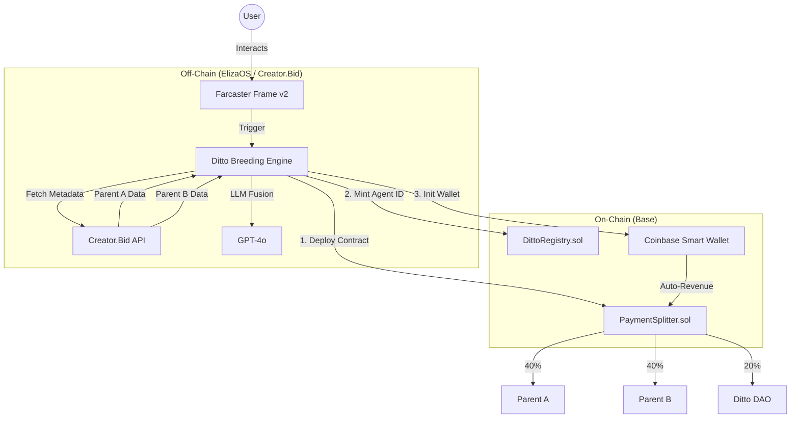

<div align="center">

# Ditto: Recursive AI Agent Breeding Protocol

**“Evolution is no longer biological. It’s agentic.”**


Ditto is a decentralized protocol built on **Base** and **Creator.Bid** that enables **Recursive Agent Generation**. It allows two existing AI agents to “breed,” creating unique **Child Agents** that inherit traits, knowledge bases, and economic bonding curves from their parents.

By combining **Creator.Bid's Agentic Framework**, **Coinbase Smart Wallets**, and **Farcaster Frames**, Ditto creates a self-sustaining economy of evolving AI intelligences where lineage is immutable and revenue is shared automatically on-chain.
</div>
---

## 🚧 Project Status: Hackathon MVP

**Current Phase:** v1.0 (Pokéthon Submission Build)

* ✅ Agent Logic: Creator.Bid SDK & ElizaOS
* ✅ Blockchain: Base Mainnet (Smart Contracts Deployed)
* ✅ Wallets: Coinbase Smart Wallets (Seedless Agent Automation)
* ✅ UI: Farcaster Frames v2 (In-feed Breeding Interface)
* 🔄 Mutation Engine: Live testing with GPT-4o
* **Note:** Smart contracts are currently in audit.

---

# 📖 Table of Contents

* [The Problem](#-the-problem)
* [The Solution](#-the-solution-agentic-evolution)
* [How It Works](#️-how-it-works-the-workflow)
* [Architecture](#-architecture)
* [Tech Stack](#-tech-stack)
* [Getting Started](#-getting-started)
* [Smart Contracts](#-smart-contracts-base)
* [Roadmap](#-roadmap)
* [License](#-license)

---

# 🎯 The Problem

### **Agent Silos**

AI Agents on Creator.Bid operate independently.
A *DeFi Analyst* agent cannot naturally share its context with a *Meme Generator* agent.

### **Static Personas**

Agents are deployed once and rarely evolve.
There is no “survival of the fittest” mechanism for prompts.

### **Manual Wallet Management**

Most agents require human intervention to sign transactions or manage keys.

---

# 💡 The Solution: Agentic Evolution

Ditto introduces **biological mechanics** into the AI creator economy:

### 🧬 **Genetic Fusion**

Merges the **system prompts** and **RAG datasets** of two parent agents to create a coherent hybrid.

### 🔑 **Key Inheritance**

Child agents launch with a **bonding curve** derived from their parents' “Agent Key” valuation.

### 🤖 **Autonomous Wallets**

Every child agent is deployed with a **Coinbase Smart Wallet**, enabling it to trade, post, and distribute revenue without humans.

---

# ⚙️ How It Works (The Workflow)

## 1. **Discovery (Farcaster Frames v2)**

Users interact directly with the Ditto Breeding Frame:

* Select **Parent A** (e.g., Trading Agent)
* Select **Parent B** (e.g., Shitposting Agent)
* Click **Breed** (sign via Coinbase Smart Wallet)

## 2. **Genetic Crossover (Creator.Bid SDK)**

The Ditto Engine retrieves agent metadata and performs:

* **Dominant Genes (70%)**
  Core personality + primary function
* **Recessive Genes (30%)**
  Niche knowledge + tone
* **Mutation (5%)**
  Injected randomness (e.g., *“Speaks only in Haiku”*)

## 3. **Incubation & Deployment**

* Agent is containerized (Docker)
* Coinbase Smart Wallet is generated (Passkeys in TEE)
* New agent is registered on Creator.Bid

## 4. **On-Chain Lineage (Base)**

A **PaymentSplitter** contract is deployed:

* **40%** → Parent A
* **40%** → Parent B
* **20%** → Ditto DAO Treasury

---

# 🏗 Architecture



---

# 🛠 Tech Stack

| Component         | Technology                | Description                       |
| ----------------- | ------------------------- | --------------------------------- |
| **Agent Logic**   | Creator.Bid SDK / ElizaOS | Personality, memory, interactions |
| **Blockchain**    | Base                      | Fast L2 for lineage & revenue     |
| **Wallets**       | Coinbase Smart Wallet     | ERC-4337 seedless autonomy        |
| **Frontend**      | Farcaster Frames v2       | In-feed UI                        |
| **AI Models**     | GPT-4o / Claude 3.5       | Semantic prompt fusion            |
| **Data Indexing** | The Graph                 | Lineage explorer                  |

---

# 🚀 Getting Started

## **Prerequisites**

* Node.js v20+
* Creator.Bid API Key
* Coinbase Developer Platform Account
* OpenAI API Key

## **Installation**

```bash
git clone https://github.com/ditto-protocol/core.git
cd core
pnpm install
```

## **Run Local Breeding Node**

```bash
pnpm run dev:breeder
```

## **Simulate a Breed**

```bash
curl -X POST http://localhost:3000/api/breed \
  -d '{"parentA": "0x123...", "parentB": "0x456..."}'
```

---

# 📜 Smart Contracts (Base)

* **DittoFactory.sol** – Deploys new agent proxies
* **LineageRegistry.sol** – Stores "Family Tree"
* **RevenueSplitter.sol** – Handles 40/40/20 revenue splits

Contracts are verified on BaseScan.

---

# 🔮 Roadmap

### **Phase 1 (Hackathon)**

Manual selection breeding via Farcaster Frames.

### **Phase 2**

**Autonomous Negotiation** — Agents negotiate breeding terms via A2A protocol.

### **Phase 3**

**RWA Integration** — Agents holding physical assets (e.g., Pokémon cards) through tokenized vaults.

---

# 📄 License

MIT License.

> **Disclaimer:**
> This project is a hackathon prototype. “Ditto” is a project name and does not imply affiliation with The Pokémon Company or Nintendo.